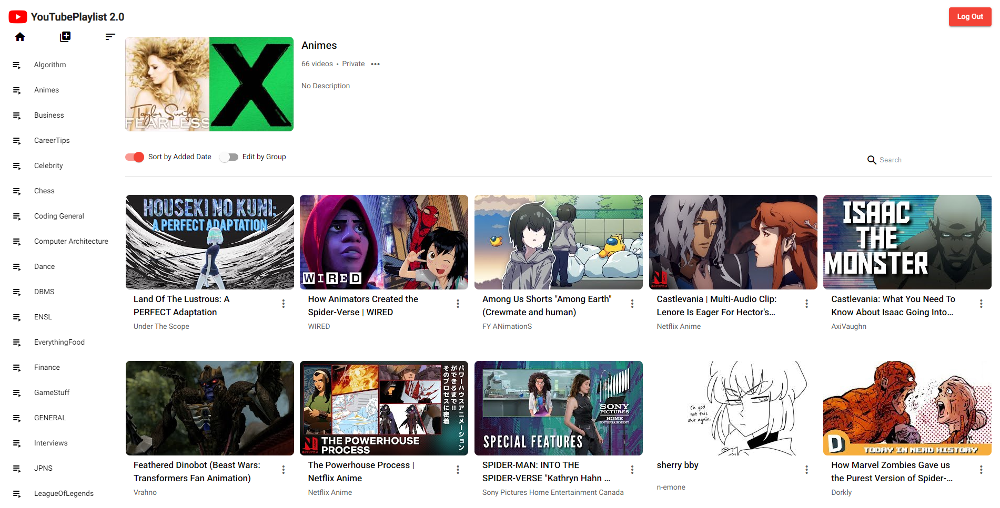

<h1 align="center"> YoutubePlaylistUpgrade </h1>

<b>A web app that upgrade your experience browsing saved videos from your precious playlists</b>

👷 Many features still in development, open for contributions! 👷

## ✍️ About

This is a web app that allows users to log in with their YouTube accounts and view their playlists in a more comfortable user interface. The new UI displays more video in a grid layout and allow users to search videos inside the playlist by keyword. Besides, users can also delete, move, and copy videos between playlists by group.

This project was generated with [Angular CLI](https://github.com/angular/angular-cli) version 13.3.0. It also uses [OAuth2.0](https://developers.google.com/identity/protocols/oauth2) and [YouTube Data API](https://developers.google.com/youtube/v3/docs/playlists/list). Due to the policy of YouTube, users cannot access the 'Watch later' playlist for now.

## 📸 Screenshot

## ✨Features

- ✔️ View playlisy videos in grid layout
- ✔️ Delete video/videos from a playlist
- ✔️ Move/copy videos from one playlist to another
- ✔️ Create new playlist
- ✔️ View all playlists alpheabtically
- ✔️ Sort videos from a playlist by added time
- ✔️ Search videos inside a playlist by title
- Edit playlist title, description and privacy
- ... and more to come!

## 📂 Installation

Run `git clone` to download the project to your local machine, then run `npm install` to install all the dependencies.

Create a `.env` file and add your own API key and Client ID to it. You can get your own API key and Client ID from [Google Cloud Platform](https://console.cloud.google.com/apis/credentials). Remember to name the variables as `NG_APP_API_KEY` and `NG_APP_CLIENT_ID`.

Run `ng serve -o` for a dev server. Navigate to `http://localhost:4200/`. The application will automatically reload if you change any of the source files.

## 💪 Contributions

Looking for contributors! Feel free to open an issue or submit a pull request. Don't forget to check out the [project](https://github.com/users/tzhang-SSR/projects/1/views/1) for remaining issues as well.

## ⚖️ License

This project is licensed under the MIT License.
